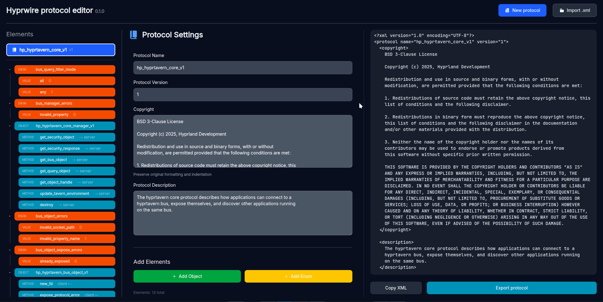

# Hyprwire protocol editor

Simplifies the editing of [these protocols](https://github.com/hyprwm/hyprwire-protocols), makes it more visual and obvious. At least I hope it does so.


[Try it out](https://relativemodder.github.io/hyprwire-protocol-editor/)



## Developing

Once you've cloned a project and installed dependencies with `npm install` (or `pnpm install` or `yarn`), start a development server:

```sh
npm run dev

# or start the server and open the app in a new browser tab
npm run dev -- --open
```

## Building

To create a production version of your app:

```sh
npm run build
```

You can preview the production build with `npm run preview`.

> To deploy your app, you may need to install an [adapter](https://svelte.dev/docs/kit/adapters) for your target environment.
